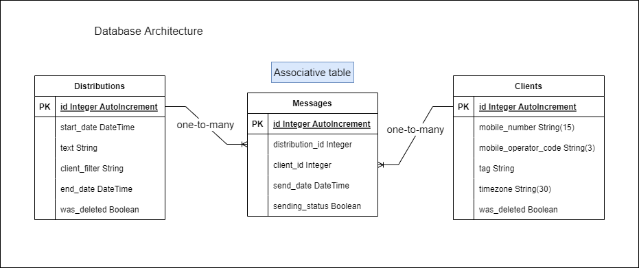
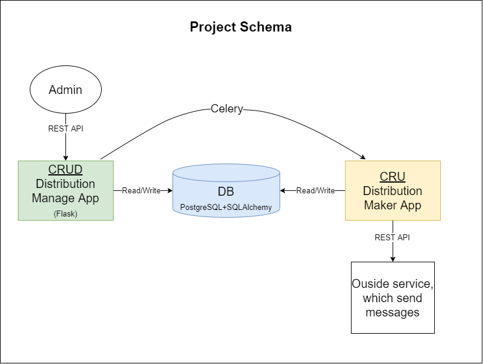

# Тестовое задание Фабрика-решений
### Создать API для управления рассылками сообщений

### Задачи
- [x] Разбить проект на модули:
  - [x] Отделить классы ОРМ моделей
  - [x] Перенести функции 
  - [x] Перенести декораторы
  - [x] Перенести руты _**(опционально)**_
- [x] Дописать руты для получения статистики
- [x] Отказаться от flask-sqlalchemy _**(опционально)**_ и использовать оригинальный sqlalchemy по причинам:
  - Многое не очевидно в реализации flask-sqlalchemy, куцая документация
  - Нет необходимости в использовании фич flask-sqlalchemy
  - Будет проще при вынесении ОРМ классов в отдельный файл
  - Применение моделей в разных приложениях в рамках одного проекта
  - Статья по этому поводу: https://towardsdatascience.com/use-flask-and-sqlalchemy-not-flask-sqlalchemy-5a64fafe22a4
- [x] Нарисовать схему архитектуры БД
- [x] Нарисовать схемы функционирования API _**(опционально)**_ 
- [x] Написать декоратор-диспетчер метода запроса
- [ ] Дополнить классы зефира полями и функцией, формирующей результат контроллера _**(опционально)**_. 
**Обновление**: не имеет смысла, т.к. message у рутов разный и зависит не только от объектов marshmallow.

### Глобальные Задачи
- [x] Созданы ОРМ модели базы данных
- [x] Созданы схемы валидации marshmallow
- [x] Написать все необходимые руты 
- [x] Создать сервис, мониторящий дату рассылок и обращающийся к стороннему API для осуществления рассылок
- [ ] __**Добавить логгирование (loguru or logging)**__ 
- [ ] Написать документацию
- [ ] Создать админ панель c помощью flask-admin
- [ ] Обернуть в docker-compose

### Архитектура базы данных:

### Архитектура проекта:

